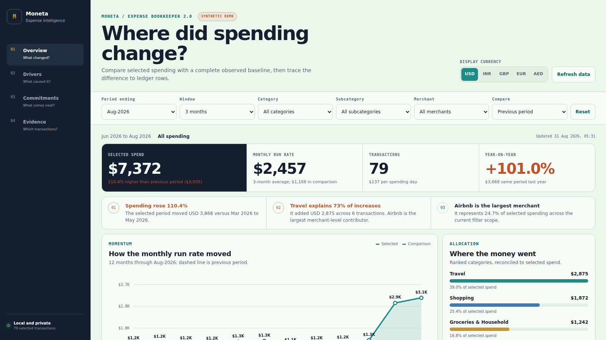
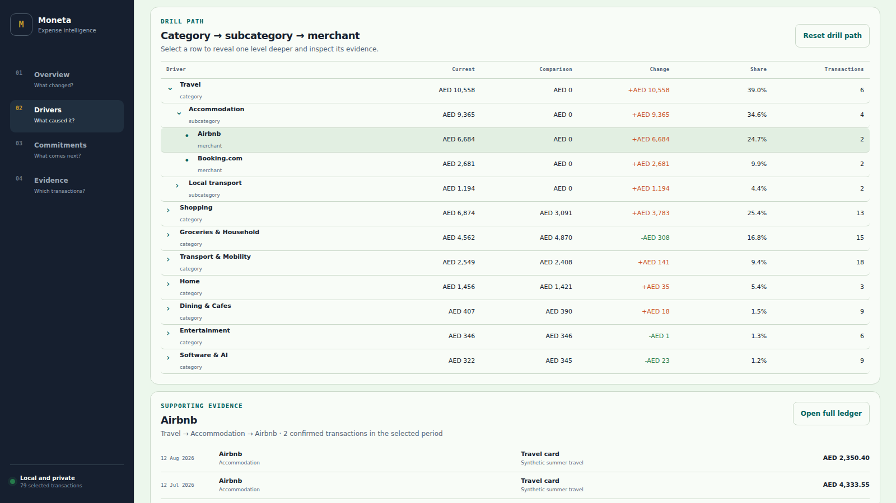
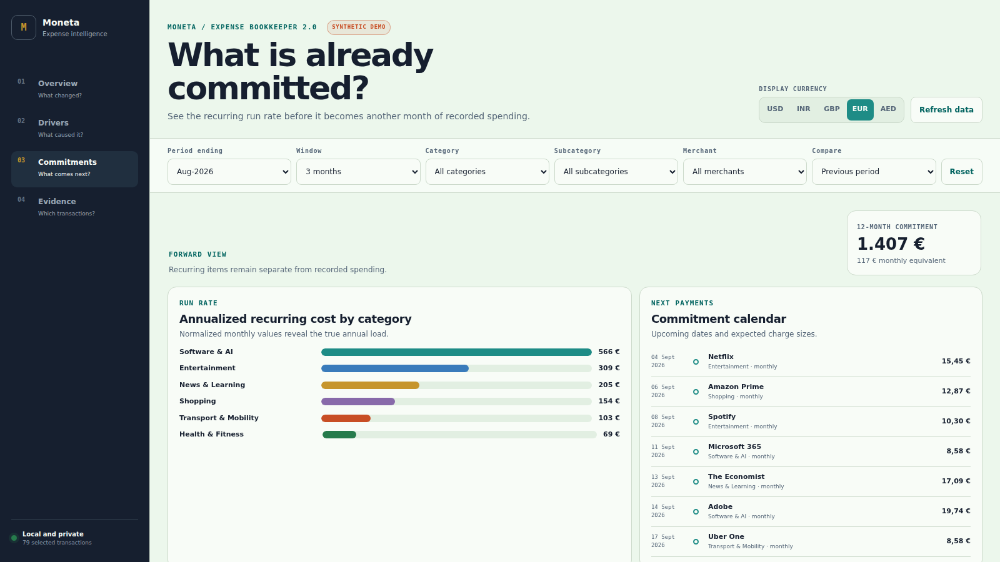
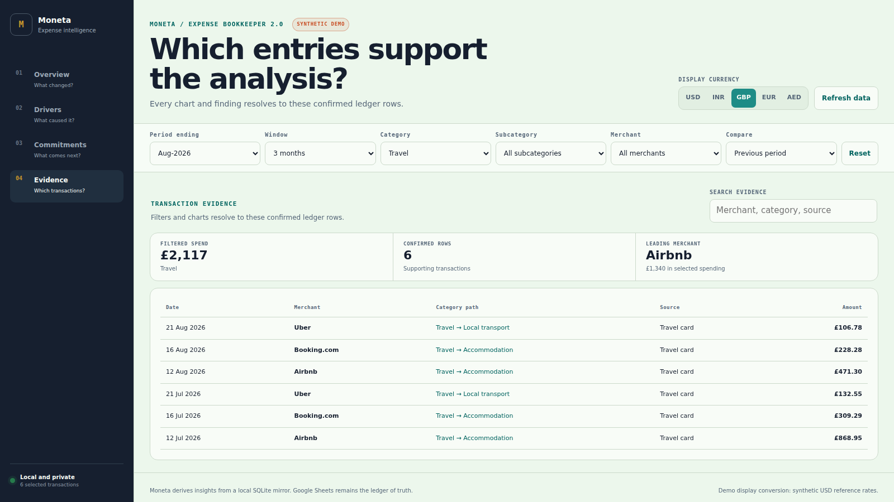

# Expense Bookkeeper + Moneta

[](https://github.com/m83iyer/expense-bookkeeper/releases/latest)

Expense Bookkeeper turns transaction alerts and statement CSVs into a private,
self-improving ledger. Moneta is its responsive local intelligence dashboard.

1. Where did spending change?
2. Which category, subcategory, merchant, and transaction caused it?
3. What recurring cost is already committed?
4. What evidence supports each conclusion?

The resolver combines the merchant master, confirmed history, recurring
amount/date patterns, and optional web evidence. It ranks up to three
taxonomy-valid choices when confidence is insufficient. Confirmed corrections
improve future matching; generic descriptors remain transaction-only. Hermes
can present the same choices over WhatsApp.

## What Moneta adds

- One-, three-, six-, and twelve-month analysis windows
- Honest previous-period and year-over-year comparisons with baseline checks
- Category → subcategory → merchant root-cause drill-down
- Power BI-style category, subcategory, and merchant multi-select slicers
- Transaction-level evidence behind every driver
- Recurring-cost register, annualized load, and a dated monthly timeline
- Display conversion between USD, INR, GBP, EUR, and AED
- A deterministic 300+ transaction demo with familiar global merchants
- A responsive desktop and mobile interface that stays on the local machine

## Moneta in four questions

| What changed? | What caused it? |
|---|---|
|  |  |
| What is committed? | Which entries support it? |
|  |  |

Currency conversion is a display layer, not accounting normalization. The
ledger keeps one reporting currency; the dashboard converts its totals using a
locally cached reference-rate snapshot.

## Public scaffold and private installation

This repository is the public reusable product. It contains application code,
generic templates, tests, and a deterministic synthetic demo—not a personal
ledger, login, Sheet ID, message target, or credential. A private Moneta
installation runs from its own configuration and data directory and does not
depend on GitHub being available.

Try the public build without connecting personal data:

```bash
git clone https://github.com/m83iyer/expense-bookkeeper.git
cd expense-bookkeeper
python3 -m venv .venv
source .venv/bin/activate
python3 -m pip install -r requirements.txt
python3 cli.py dashboard-demo --output ./demo-runtime
python3 cli.py dashboard-serve --config ./demo-runtime/config.demo.yaml
```
Open `http://127.0.0.1:8765`. The demo uses fixed synthetic transactions,
synthetic exchange rates, and public merchant names. It contains no Sheet ID,
email address, phone number, credential, or real expense.

## Install your own tracker

```bash
python3 cli.py setup
python3 cli.py validate --config ~/.expense-bookkeeper/config.yaml
```
The setup wizard creates configuration and runtime state under
`~/.expense-bookkeeper/`. Credentials, Sheet IDs, transactions, message
targets, and tokens stay outside the repository.

To refresh and open the private dashboard:

```bash
python3 cli.py dashboard-sync
python3 cli.py dashboard-fx-refresh
python3 cli.py dashboard-serve
```

Open `http://127.0.0.1:8765`. The server binds to loopback by default. Read
[dashboard operation](references/dashboard.md) before enabling phone access or
cash entry.

## Data flow

```text
Alert, CSV, or manual entry
  -> parse and duplicate check
  -> category taxonomy + merchant master + historical evidence
       -> known merchant: validated classification
       -> uncertain merchant: ranked review choices
       -> generic descriptor: transaction-only review
       -> confirmed correction: future rule + audit trail
  -> Google Sheet (source of truth)
       -> atomic SQLite mirror
       -> Moneta: overview, drivers, commitments, evidence
```

Normal capture and analysis are deterministic Python workflows. An LLM is not
required. Optional merchant research can add evidence, but it cannot approve
its own suggestion or bypass the active taxonomy.

## Safety and privacy

- Live writes remain blocked while `armed: false`.
- Validation performs a write, read, and delete proof on `EXPENSES_TEST`.
- Unknown merchants enter review; no category is silently invented.
- Merchant-wide and historical corrections require a preview and confirmation.
- Mixed reporting currencies fail closed before dashboard totals are built.
- The optional FX refresh sends currency codes only. Ledger rows never leave
  the machine for conversion.
- Cash entry is off by default and requires a local write token when enabled.
- Release qualification scans the current tree and reachable history for
  credentials, personal identifiers, Sheet URLs, and user-specific paths.

## Repository map

```text
dashboard/             Moneta analytics, FX cache, synthetic demo, and UI
scripts/               Capture, classification, reconciliation, and validation
references/            Architecture, setup, adapters, dashboard, and migration
templates/             Config, scheduler, ledger, and regional examples
tests/                 Behavior, safety, privacy, and analytics contracts
cli.py                 Standalone command entry point
SKILL.md               Optional agent-runtime instructions
```

## Development and release

```bash
python3 -m pip install -r requirements.txt -r requirements-dev.txt
python3 -m pytest tests/ -q
python3 -m compileall -q cli.py scripts dashboard tests
node --check dashboard/static/app.js
python3 scripts/privacy_audit.py . --history
```

Release qualification is manual and exact-commit bound. Routine pushes do not
trigger Actions. The cloud gate covers Python 3.10, 3.12, and 3.14 and retains
its proof artifact.

Start with [setup](references/setup-flow.md), [architecture](references/architecture.md),
[dashboard operation](references/dashboard.md), or [migration](references/migration-v2.md).

MIT licensed. Report security issues through
[GitHub private vulnerability reporting](https://github.com/m83iyer/expense-bookkeeper/security/advisories/new).
